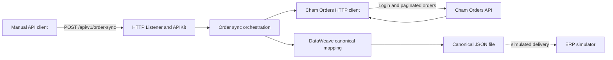

# Cham Orders Mule Integration

MuleSoft integration that synchronizes confirmed orders from [Cham Orders API](https://github.com/Aslannt/cham-orders-api) into a canonical JSON file that simulates delivery to an ERP.

This repository is a portfolio case study from **ChamTech**, the personal software engineering lab and professional brand of Deivid Vanegas. ChamTech is not a company or a commercial product. All names, credentials, identifiers, and business data used during local verification are synthetic.

## Project status

**MVP implemented and verified locally.**

The current implementation has been deployed on Mule Runtime 4.12.0 EE through Anypoint Studio and verified against the real Cham Orders API Release Candidate. Verification includes authentication, complete pagination, canonical DataWeave mapping, JSON file generation, correlation propagation, stable error responses, and 12 passing MUnit tests.

The integration client was implemented against the runtime OpenAPI contract generated from Cham Orders API `main` commit `da48b5f`. No downstream endpoint, parameter, or business field was invented for the client implementation.

## What the MVP implements

- `POST /api/v1/order-sync` as the manual synchronization operation.
- APIKit routing and RAML request validation.
- Authentication through `POST /api/v1/auth/login`.
- Retrieval through `GET /api/v1/orders` with `status`, `page`, and `size` query parameters.
- Complete sequential pagination using backend metadata.
- Validation of authentication, pagination, and order responses.
- DataWeave transformation into a canonical downstream model.
- JSON file output that simulates an ERP delivery.
- Propagation or generation of `X-Correlation-ID`.
- Stable API and downstream error contracts.
- Externalized local configuration with no credentials stored in Git.
- MUnit tests for orchestration, mapping, the Cham Orders client, pagination, and error handling.

The MVP deliberately excludes a database, Object Store, queues, Anypoint MQ, Kafka, schedulers, Batch Job, persistent idempotency, advanced retries, a real ERP, CloudHub deployment, and CI/CD automation.

## Technology

| Area | Version or choice |
| --- | --- |
| Anypoint Studio | 7.26.0 |
| Mule Runtime | 4.12.0 EE |
| Java specification | 17 |
| Mule Maven Plugin | 4.10.0 |
| HTTP Connector | 1.11.3 |
| APIKit | 1.11.17 |
| File Connector | 1.5.5 |
| MUnit | 3.7.1 |
| API contract | RAML 1.0 |
| Transformation | DataWeave 2.0 |

## Architecture



The integration is synchronous. It authenticates for each synchronization request, retrieves every page in order, accumulates the confirmed orders in memory, validates the collected result, transforms it once, writes one output file, and returns an execution summary.

See [docs/architecture.md](docs/architecture.md) for component responsibilities, pagination invariants, error handling, and design decisions.

## Repository structure

```text
src/
├── main/
│   ├── mule/
│   │   ├── global-config.xml
│   │   ├── cham-orders-integration-api.xml
│   │   ├── order-sync.xml
│   │   ├── cham-orders-client.xml
│   │   └── error-handlers.xml
│   └── resources/
│       ├── api/cham-orders-integration-api.raml
│       ├── dw/
│       │   ├── has-invalid-orders.dwl
│       │   ├── integration-error.dwl
│       │   └── orders-to-canonical.dwl
│       ├── config-local.yaml
│       └── log4j2.xml
└── test/
    ├── munit/
    └── resources/mock-data/
docs/
└── architecture.md
pom.xml
mule-artifact.json
```

## API contract

### Synchronize confirmed orders

```http
POST /api/v1/order-sync
Content-Type: application/json
X-Correlation-ID: optional-client-value
```

Request:

```json
{
  "status": "CONFIRMED",
  "pageSize": 20
}
```

`status` accepts only `CONFIRMED`. `pageSize` is optional, defaults to `20`, and accepts values from `1` through `100`.

Successful response:

```json
{
  "correlationId": "cham-integration-123",
  "status": "COMPLETED",
  "ordersRead": 2,
  "ordersExported": 2,
  "outputFile": "confirmed-orders-20260715-045230-655.json"
}
```

The values depend on the current backend data and execution timestamp.

## Canonical output

Each successful execution creates one file named:

```text
confirmed-orders-yyyyMMdd-HHmmss-SSS.json
```

Canonical structure:

```json
{
  "source": "CHAM_ORDERS",
  "generatedAt": "2026-07-15T04:52:30.6551381-05:00",
  "correlationId": "cham-integration-123",
  "orders": [
    {
      "orderId": "11111111-1111-1111-1111-111111111111",
      "customerId": "aaaaaaaa-aaaa-aaaa-aaaa-aaaaaaaaaaaa",
      "status": "CONFIRMED",
      "total": 59.85,
      "items": [
        {
          "sku": "NOTE-001",
          "name": "Synthetic Notebook",
          "quantity": 2,
          "unitPrice": 24.90,
          "subtotal": 49.80
        }
      ]
    }
  ]
}
```

The item name, SKU, and price are the historical snapshots supplied by Cham Orders API.

## Requirements

- Anypoint Studio 7.26.0.
- Mule Runtime 4.12.0 EE installed in Studio.
- The Studio embedded JDK 17 selected for the Mule project.
- Git.
- Cham Orders API running locally on port `8080`.
- Docker Desktop and Docker Compose v2 for the recommended backend workflow.

A global Maven installation is not required for the verified Anypoint Studio workflow.

## Local configuration

The non-secret local properties are stored in `src/main/resources/config-local.yaml`. The listener uses port `8081`, and the Cham Orders client targets `localhost:8080` with base path `/api/v1`.

Configure the following variables in the Anypoint Studio Mule Application Run Configuration under **Environment**:

| Variable | Purpose |
| --- | --- |
| `CHAM_ORDERS_USERNAME` | Username accepted by the local Cham Orders API login operation. |
| `CHAM_ORDERS_PASSWORD` | Matching local password. |

Do not add real values to YAML, XML, source files, launch files, documentation, or Git history.

To force generated files into this repository's ignored `output` directory, add this VM argument under **Arguments**:

```text
-Doutput.directory=C:/path/to/cham-orders-mule-integration/output
```

Use forward slashes in the Windows path. Without an explicit absolute value, a relative `./output` path is resolved from the Mule runtime working directory.

## Run locally

### 1. Start Cham Orders API

From the backend repository:

```bash
cd /c/Dev/ChamTech/cham-orders-api
docker compose up --build -d
docker compose ps
```

Wait until the runtime contract returns HTTP 200:

```bash
curl -sS -o /dev/null \
  -w "Cham Orders API HTTP %{http_code}\n" \
  http://localhost:8080/v3/api-docs.yaml
```

### 2. Run the Mule application

In Anypoint Studio:

1. Import the repository as an Anypoint Studio project.
2. Confirm Mule Runtime 4.12.0 EE and Java 17.
3. Configure the two environment variables and output VM argument.
4. Run the project as **Mule Application**.
5. Wait for the `DEPLOYED` application status.

API Console:

```text
http://localhost:8081/console/
```

### 3. Trigger a synchronization

```bash
curl -i --request POST 'http://localhost:8081/api/v1/order-sync' \
  --header 'Content-Type: application/json' \
  --header 'X-Correlation-ID: cham-local-sync-001' \
  --data '{"status":"CONFIRMED","pageSize":20}'
```

Verify the generated file:

```bash
latest_file=$(find ./output -maxdepth 1 -type f \
  -name 'confirmed-orders-*.json' | sort | tail -n 1)

echo "$latest_file"
sed -n '1,260p' "$latest_file"
```

The `output/` and `reports/` directories are intentionally ignored by Git.

## Correlation ID

When the caller supplies `X-Correlation-ID`, Mule uses it throughout the request, downstream HTTP calls, logs, response header, response body, and canonical file. When the header is absent, Mule generates a correlation ID and returns it through the same channels.

## Error contract

Errors use this common structure:

```json
{
  "code": "INVALID_REQUEST",
  "message": "The synchronization request is invalid.",
  "timestamp": "2026-07-15T04:39:26.4405098-05:00",
  "path": "/api/v1/order-sync",
  "correlationId": "cham-invalid-request-001",
  "fieldErrors": {}
}
```

| HTTP | Code | Condition |
| --- | --- | --- |
| 400 | `INVALID_REQUEST` | RAML or APIKit request validation failed. |
| 401 | `CHAM_ORDERS_AUTHENTICATION_ERROR` | Login failed or returned incomplete token information. |
| 404 | `RESOURCE_NOT_FOUND` | The integration route does not exist. |
| 405 | `METHOD_NOT_ALLOWED` | The route does not support the HTTP method. |
| 406 | `NOT_ACCEPTABLE` | The requested response type is not supported. |
| 415 | `UNSUPPORTED_MEDIA_TYPE` | The request does not use a supported media type. |
| 500 | `INTEGRATION_ERROR` | An unexpected integration error occurred. |
| 501 | `NOT_IMPLEMENTED` | APIKit found an operation without an implementation. |
| 502 | `CHAM_ORDERS_UNAVAILABLE` | Cham Orders API is unavailable or returned an invalid response. |

## Pagination behavior

The client starts at page zero and stores the first response's `totalPages` and `totalElements`. Every remaining page must preserve those totals and must return the requested page number and page size. After collecting the pages, the integration verifies that the collected order count equals `totalElements`.

Any missing or inconsistent pagination metadata produces `CHAM_ORDERS:INVALID_RESPONSE`, returned to the caller as HTTP 502.

## Tests

Run all tests from Anypoint Studio by selecting the project and choosing:

```text
Run As → MUnit Test
```

Verified MUnit result:

```text
Tests run: 12
Failures: 0
Errors: 0
Skipped: 0
```

Test coverage includes:

- Successful orchestration and default page size.
- Canonical DataWeave mapping and output-file interaction.
- Rejection of invalid downstream orders.
- Successful and invalid authentication responses.
- Valid and invalid page responses.
- Two-page collection and metadata consistency.
- Stable 400, 401, 500, and 502 global error mappings.

Recorded MUnit coverage:

| Resource | Coverage |
| --- | ---: |
| Application | 66.28% |
| `order-sync.xml` | 100% |
| `cham-orders-client.xml` | 95.65% |
| `error-handlers.xml` | 43.18% |
| `cham-orders-integration-api.xml` | 0% |

The APIKit listener and routing contracts were verified through real HTTP tests rather than direct unit invocation.

## End-to-end verification performed

The local verification executed the following checks against the real backend and Mule runtime:

- Cham Orders API release-candidate smoke test completed successfully.
- Mule application deployed on Runtime 4.12.0 EE.
- Authentication succeeded with local synthetic credentials.
- Empty-result synchronization created a canonical file with an empty array.
- Two confirmed orders were retrieved using `pageSize: 1`, proving traversal of multiple pages.
- Historical SKU, name, quantity, unit price, subtotal, and total values were mapped into the canonical file.
- Supplied and generated correlation IDs were propagated.
- Invalid request, unsupported media type, unsupported method, and unknown route contracts were exercised.
- Invalid backend credentials returned HTTP 401.
- A stopped backend returned HTTP 502.
- Restoring credentials and the backend returned the integration to HTTP 200.

## Security notes

- No credentials or tokens are stored in Git.
- Authentication responses and authorization variables are removed after use.
- Output and coverage reports are ignored.
- Logs include correlation and operational metadata, not passwords or access tokens.
- The local credentials are synthetic and intended only for the backend's local profile.

## Author

**Deivid Vanegas**

MuleSoft Developer · Integration Engineer · Java Backend Developer

GitHub: [Aslannt](https://github.com/Aslannt)
