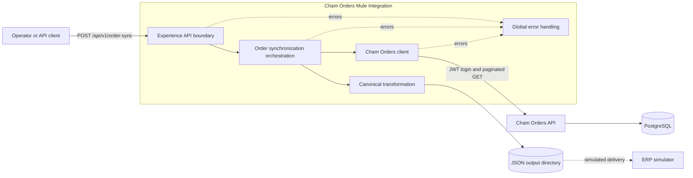
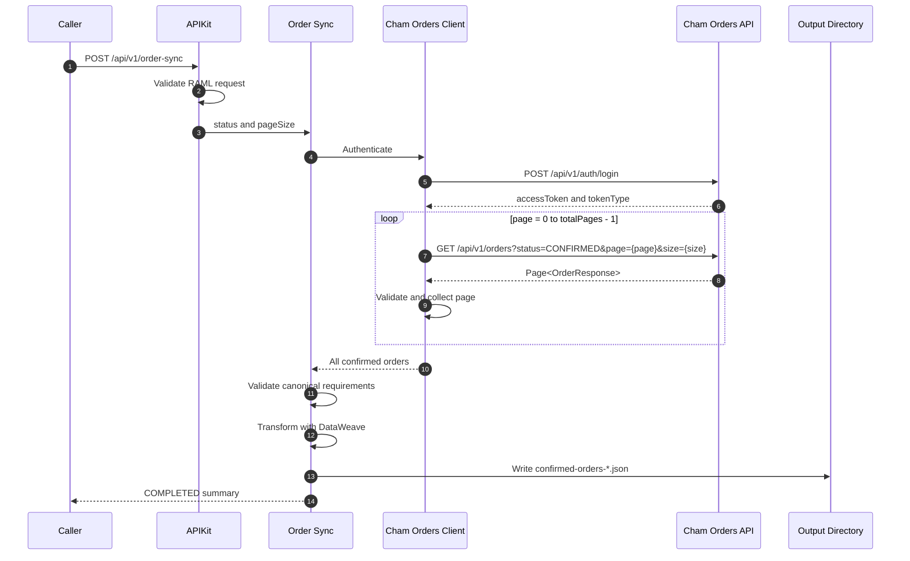
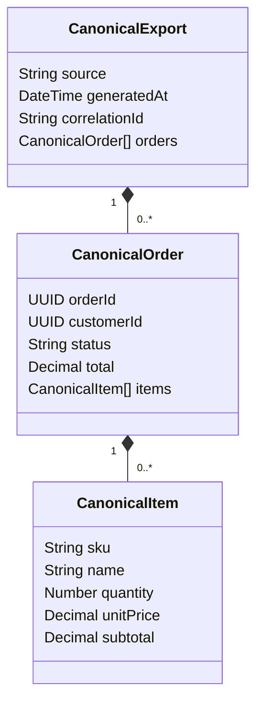

# Architecture

## 1. Purpose

Cham Orders Mule Integration is a synchronous Mule 4 application that exports confirmed orders from Cham Orders API into a canonical JSON document. The file output is an ERP delivery simulator: it demonstrates the integration boundary without introducing a real ERP dependency.

ChamTech is the personal software engineering lab and professional brand of Deivid Vanegas. It is not a company or a commercial system.

## 2. System context



## 3. Runtime components

| Resource | Responsibility |
| --- | --- |
| `global-config.xml` | Loads environment properties and defines HTTP Listener, HTTP Request, and File Connector configurations. |
| `cham-orders-integration-api.xml` | Exposes the HTTP boundary, APIKit router, API Console, response headers, and operation flow. |
| `order-sync.xml` | Coordinates the synchronization request, validation, transformation, file write, and summary response. |
| `cham-orders-client.xml` | Authenticates, retrieves pages, validates metadata, collects orders, and removes transient security variables. |
| `error-handlers.xml` | Maps APIKit, authentication, HTTP, invalid-response, and unexpected errors into stable contracts. |
| `orders-to-canonical.dwl` | Maps backend orders and historical item snapshots into the downstream model. |
| `has-invalid-orders.dwl` | Rejects orders that cannot be safely mapped to the canonical confirmed-order model. |
| `integration-error.dwl` | Produces the shared API error representation. |

## 4. Synchronization sequence



The same Mule correlation ID is used for the entire sequence.

## 5. API boundary

The public operation is:

```text
POST /api/v1/order-sync
```

The RAML contract restricts `status` to `CONFIRMED`. `pageSize` is optional, defaults to 20, and accepts values from 1 through 100. APIKit performs contract validation before orchestration begins.

The API boundary is intentionally small. Scheduling and automatic execution are outside the MVP, so every synchronization starts from an explicit HTTP request.

## 6. Downstream contract

The client uses only operations and fields present in the Cham Orders API runtime OpenAPI contract:

| Purpose | Operation |
| --- | --- |
| Authentication | `POST /api/v1/auth/login` |
| Confirmed-order retrieval | `GET /api/v1/orders?status=CONFIRMED&page={page}&size={size}` |

The login response must contain `accessToken` and `tokenType`. The page response must contain `content`, `page`, `size`, `totalElements`, `totalPages`, `first`, and `last`.

## 7. Pagination algorithm and invariants

Pagination is processed sequentially:

1. Set `currentPage` to zero and initialize an empty collection.
2. Retrieve page zero.
3. Store `totalPages` and `totalElements` as the expected metadata.
4. Collect the first page content.
5. Iterate from page one through `totalPages - 1`.
6. Verify every response matches the requested page and configured page size.
7. Verify every subsequent response preserves the first page's totals.
8. Append each page's content in page order.
9. Verify the final collection size equals `totalElements`.
10. Remove page metadata and downstream authorization variables.

These checks prevent silent partial exports when the backend returns missing, changing, or internally inconsistent pagination metadata.

The implementation holds all retrieved orders in memory. That is an explicit MVP tradeoff suitable for the demonstrated local data volume. Batch processing, streaming, persistent checkpoints, and resume behavior are outside the current scope.

## 8. Canonical model



Mapping:

| Cham Orders field | Canonical field |
| --- | --- |
| `order.id` | `orderId` |
| `order.customerId` | `customerId` |
| `order.status` | `status` |
| `order.total` | `total` |
| `item.productSku` | `sku` |
| `item.productName` | `name` |
| `item.quantity` | `quantity` |
| `item.unitPrice` | `unitPrice` |
| `item.subtotal` | `subtotal` |

The integration preserves backend monetary values and historical product snapshots. It does not recalculate totals.

## 9. Correlation and observability

The HTTP Listener accepts `X-Correlation-ID`. Mule propagates that value as the event correlation ID or generates one when the header is absent.

The correlation ID is included in:

- Downstream HTTP requests.
- Synchronization start and completion logs.
- Per-page retrieval logs.
- Error logs.
- HTTP success and error response headers.
- Success and error response bodies.
- The canonical output file.

Operational logs include page number, page size, collected counts, expected totals, output filename, and error type. Credentials and access tokens are not logged.

## 10. Error handling

All main and API Console errors reference `order-sync-global-error-handler`.

| Source error | HTTP | Stable code |
| --- | ---: | --- |
| `APIKIT:BAD_REQUEST` | 400 | `INVALID_REQUEST` |
| `CHAM_ORDERS:AUTHENTICATION_ERROR`, `HTTP:UNAUTHORIZED`, `HTTP:FORBIDDEN` | 401 | `CHAM_ORDERS_AUTHENTICATION_ERROR` |
| `APIKIT:NOT_FOUND` | 404 | `RESOURCE_NOT_FOUND` |
| `APIKIT:METHOD_NOT_ALLOWED` | 405 | `METHOD_NOT_ALLOWED` |
| `APIKIT:NOT_ACCEPTABLE` | 406 | `NOT_ACCEPTABLE` |
| `APIKIT:UNSUPPORTED_MEDIA_TYPE` | 415 | `UNSUPPORTED_MEDIA_TYPE` |
| `APIKIT:NOT_IMPLEMENTED` | 501 | `NOT_IMPLEMENTED` |
| `CHAM_ORDERS:INVALID_RESPONSE` | 502 | `CHAM_ORDERS_UNAVAILABLE` |
| Other `HTTP:*` errors | 502 | `CHAM_ORDERS_UNAVAILABLE` |
| Any unmatched error | 500 | `INTEGRATION_ERROR` |

The client receives a stable message and code without internal stack traces or downstream response bodies.

## 11. Configuration and secrets

`global-config.xml` loads `config-${env}.yaml`; the current global `env` value is `local`. Host, port, base path, timeout, and output directory are properties rather than flow literals.

The only credentials required by the Mule application are:

```text
CHAM_ORDERS_USERNAME
CHAM_ORDERS_PASSWORD
```

They are configured in the Anypoint Studio Run Configuration environment and read at runtime. They are not stored in Git. The local output directory can be overridden with the `output.directory` system property.

## 12. File delivery

The File Connector writes one UTF-8 JSON document using `CREATE_NEW`, which prevents overwriting an existing filename. The timestamp includes milliseconds to reduce collisions between local executions.

The current destination is a local directory, not a real ERP endpoint. The file boundary makes the canonical contract observable and testable without introducing a vendor-specific adapter.

## 13. Test strategy

### MUnit

The verified automated suite contains 12 passing tests:

- Two orchestration and canonical-transformation tests.
- Six client, authentication, and pagination tests.
- Four global error-handler tests.

HTTP requests and file writes are mocked in MUnit. Fixtures reproduce valid, missing, and inconsistent page responses.

Recorded application coverage is 66.28%. The primary orchestration resource is at 100%, and the Cham Orders client is at 95.65%.

### Real runtime verification

MUnit is complemented by real local integration checks:

- Cham Orders API release-candidate smoke suite.
- Mule deployment on Runtime 4.12.0 EE.
- Real JWT authentication.
- Empty-result export.
- Two-order export using `pageSize: 1` to force multiple pages.
- Canonical file inspection.
- Provided and generated correlation IDs.
- HTTP 400, 401, 404, 405, 415, 500, and 502 contracts.
- Recovery after restoring credentials and backend availability.

## 14. Design decisions

| Decision | Rationale | Consequence |
| --- | --- | --- |
| Manual HTTP trigger | Keeps the MVP observable and controllable. | No scheduled synchronization. |
| Authenticate per request | Avoids token persistence and Object Store. | Adds one login call per execution. |
| Sequential pagination | Preserves order and simplifies metadata checks. | No parallel page retrieval. |
| In-memory collection | Keeps orchestration small for portfolio-scale data. | Not designed for very large datasets. |
| One file per execution | Provides a clear simulated delivery artifact. | No partial file streaming or resume. |
| Global error handler | Keeps status and code mappings consistent. | Error policies are shared across API flows. |
| External runtime credentials | Prevents secrets in source control. | Local Run Configuration is required. |

## 15. Explicitly deferred capabilities

- Database or persistence owned by the integration.
- Object Store and persistent idempotency.
- Scheduler or Batch Job.
- Anypoint MQ, Kafka, or other messaging.
- Advanced retries and circuit breaking.
- Real ERP transport.
- CloudHub deployment.
- CI/CD pipeline.
- Distributed tracing platform.

These capabilities can be evaluated in future iterations but are not implied by the current MVP.
